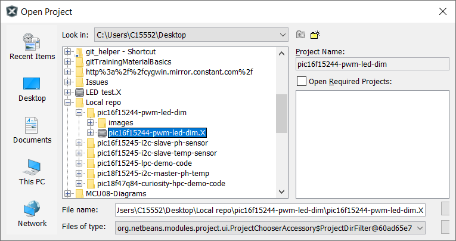
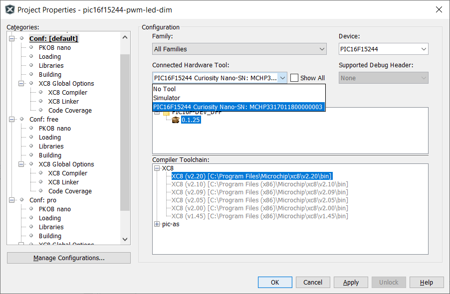
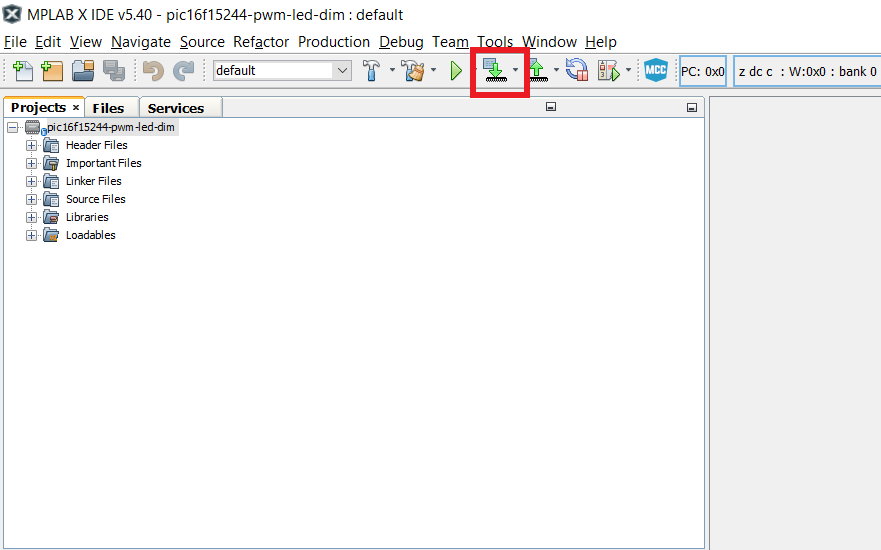
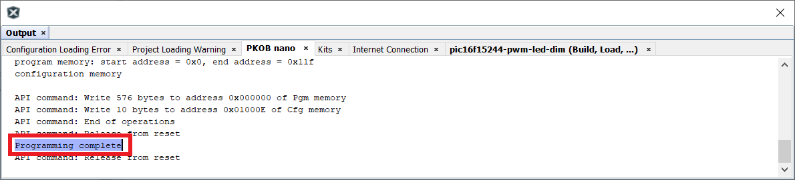
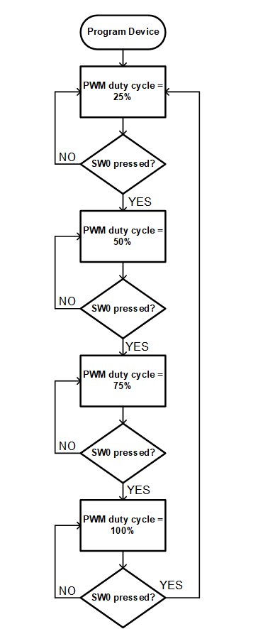

<!-- Please do not change this html logo with link -->

# Dim an LED using PWM with PIC16F15244

The 'pic16f15244-pwm-led-dim' code example uses the PIC16F15244 Curiosity Nano Development board to demonstrate how to use the PWM module to dim an LED.

##### PIC16F15244 Curiosity Nano Development Board:

## Related Documentation
- [PIC16F15244 Product Page](https://www.microchip.com/wwwproducts/en/PIC16F15244)

## Software Used
- MPLAB® X IDE 5.40 or newer [(microchip.com/mplab/mplab-x-ide)](http://www.microchip.com/mplab/mplab-x-ide)
- MPLAB® XC8 2.20 or a newer compiler [(microchip.com/mplab/compilers)](http://www.microchip.com/mplab/compilers)
- MPLAB® Code Configurator (MCC) 3.95.0 or newer [(microchip.com/mplab/mplab-code-configurator)](https://www.microchip.com/mplab/mplab-code-configurator)
- MPLAB® Code Configurator (MCC) Device Libraries PIC10 / PIC12 / PIC16 / PIC18 MCUs [(microchip.com/mplab/mplab-code-configurator)](https://www.microchip.com/mplab/mplab-code-configurator)
- Microchip PIC16F1xxxx Series Device Support (1.4.119) or newer [(packs.download.microchip.com/)](https://packs.download.microchip.com/)

## Hardware Used
- PIC16F15244 Curiosity Nano [(DMxxxx)]()
- Micro-USB to USB 2.0 cable

## Setup
1. Connect the PIC16f15244 Curiosity Nano board to a PC using the Micro-USB to USB 2.0 cable.
2. If not already on your system, download and install MPLABX IDE version 5.40 (or newer).
3. If not already on your system, download and install the XC8 C-Compiler version 2.20 (or newer).
4. Open the 'pic16f15244-pwm-led-dim.X' project as shown in Figure 1.

###### Figure 1: Open Project Window

5. Press the 'Project Properites' button to open the Project Properties window. Select the Curiosity tool from the Tools drop-down menu as shown in Figure 2.

###### Figure 2: Select the Nano in Project Properties Window

6. Press the 'Make and Program Device' button to program the PIC (see Figure 3). Verify that the device was successfully programmed (see Figure 4).

###### Figure 3: 'Make and Program Device' Button

###### Figure 4: Program Complete

## Operation
The code example cycles through four different PWM configurations to demonstrate the effects each PWM duty cycle has on LED0. At power-up, the PWM module is confiugured to provide a 25% duty cycle to LED0. This means that LED0 is illuminated only 25% of each PWM cycle, and the LED will appear to be dimly lit.

When push-button SW0 is pressed once, the PWM module is reconfigured to provide a 50% duty cycle, which means LED0 is illuminated 50% of each PWM period. This results in a slightly brighter LED output.

When SW0 is pressed a second time, the PWM module is reconfigured to provide a 75% duty cycle, which means LED0 is illuminted 75% of the time. This results in an even brighter LED output.

When SW0 is pressed a third time, the PWM module is reconfigured to provide a 100% duty cycle, which means the LED will be turned on the entire PWM period. This results in the LED providing full illumination.

When SW0 is pressed a fourth time, the program returns to the default configuration of 25% duty cycle. Each time SW0 is pressed, the program reconfigures the PWM duty cycle. Figure 5 shows the program flowchart.

###### Figure 5: Code Example Flowchart

## Summary
The 'pic16f15244-pwm-led-dim' code example highlights the use of the PWM module to change the brightness of an LED.
